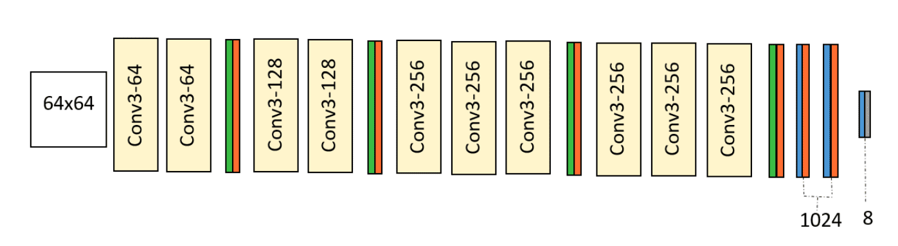

# rede-vgg13
Rede Neural Convolucional VGG13

 Para realizar a implementação, deverão ser utilizadas as bibliotecas TensorFlow ou PyTorch, na linguagem Python. Você não deve utilizar implementações completas das redes já existentes nos repositórios das bibliotecas, mas compor as diversas camadas (convolucionais, pooling e totalmente conectadas) para construir as redes de acordo com as propostas da literatura. Você pode utilizar as implementações das bibliotecas para cada um desses componentes e para os demais componentes da rede (funções de ativação, perda, configuração de dataset, treinamento, etc).

 

# Como executar:
## Crie um novo ambiente Conda
conda create --name vgg13_env python=3.8

## Ative o ambiente
conda activate vgg13_env

## Instale o TensorFlow com suporte para GPU e outras dependências
conda install -c conda-forge cudatoolkit=11.2 cudnn=8.1.0 tensorflow-gpu numpy matplotlib scikit-learn

## Execute o código
python index.py